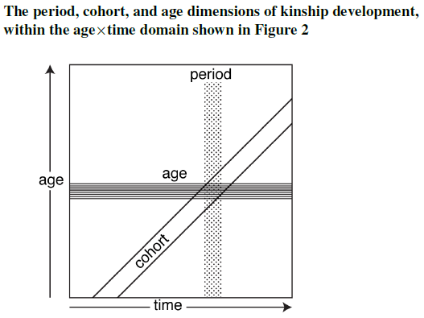

### Módulo 2 · Laboratorio: estimación de parentesco con DemoKin {#modulo2}

*A cargo de Diego Alburez-Gutierrez.*

En este laboratorio aprenderemos a estimar las **redes de parentesco** de una
persona promedio (a quien llamaremos *Focal*) usando el paquete **DemoKin**. Nos
concentraremos en el modelo más completo que usaremos en el taller: el modelo
**de dos sexos y variable en el tiempo**, con salida por **período**. Este es
exactamente el modelo que sustenta las estimaciones de duelo del Módulo 3.

```{r m2-libs, message=FALSE}
library(tidyverse)
library(DemoKin)
library(arrow)
```

**Contenido de este módulo:**

- [2.1 El modelo de dos sexos y variable en el tiempo](#m2-modelo)
- [2.2 El diagrama de parentesco: cómo se eligen los parientes](#m2-diagrama)
- [2.3 Preparación de los insumos](#m2-insumos)
- [2.4 Estimación con `kin2sex()`](#m2-kin2sex)
- [2.5 Número de parientes vivos por edad de Focal](#m2-vivos)
- [2.6 Distribución por edad de los parientes](#m2-distribucion)

#### 2.1 El modelo de dos sexos y variable en el tiempo {#m2-modelo}

La idea central de los modelos matriciales de parentesco [@caswell_formal_2019]
es una **recurrencia por edad de Focal**: el número esperado de parientes de un
tipo dado que Focal tiene a la edad $x+1$ se obtiene proyectando a los parientes
que tenía a la edad $x$ (que sobreviven y envejecen un año) y sumando los
**nuevos** parientes que aparecen en el intervalo:

$$
\mathbf{k}(x+1) = \mathbf{U}\,\mathbf{k}(x) \;+\; \boldsymbol{\beta}(x),
\qquad \mathbf{k}(0)=\mathbf{k}_0 .
$$

Aquí $\mathbf{k}(x)$ es un **vector**, no un número: es la distribución por edad
de un tipo de pariente (cuántas hijas de 0 años, de 1 año, …, tiene Focal cuando
ella tiene la edad $x$). La ecuación tiene tres ingredientes:

- $\mathbf{U}$, la **matriz de supervivencia**: mueve a cada pariente un año hacia
  arriba en la escala de edad, con su probabilidad de sobrevivir. Es la que hace
  "envejecer" la red de un año al siguiente.
- $\boldsymbol{\beta}(x)$, el **subsidio**: los parientes nuevos que se incorporan
  en el intervalo (se explica enseguida).
- $\mathbf{k}_0$, la **condición inicial**: los parientes que ya existen en el
  momento en que Focal nace.

**El subsidio $\boldsymbol{\beta}(x)$: de dónde salen los parientes nuevos.**
El término $\mathbf{U}\,\mathbf{k}(x)$ solo hace envejecer a los parientes que ya
había; por sí solo, la red nunca crecería. El **subsidio** es el flujo de
parientes nuevos, y es lo que **acopla** unos tipos de pariente con otros. Casi
siempre esos parientes nuevos llegan por un **nacimiento**, así que entran en la
clase de edad 0; la clave es *quién* los tiene. El subsidio de un tipo de pariente
se calcula a partir de la **abundancia de otro** pariente. Por ejemplo:

- las **hijas** de Focal nacen de la propia Focal, de modo que su subsidio es
  simplemente la fecundidad de Focal a la edad $x$;
- las **nietas** nacen de las hijas de Focal, así que su subsidio depende de la
  distribución por edad de las hijas, $\mathbf{d}(x)$:
  $$\boldsymbol{\beta}_{\text{nietas}}(x) = \mathbf{F}\,\mathbf{d}(x),$$
  donde $\mathbf{F}$ es la matriz de fecundidad por edad (coloca los nacimientos
  en la edad 0).

Este encadenamiento —un pariente "produce" a otro— es justamente lo que resume el
**diagrama de parentesco** de la sección 2.2.

**La condición inicial $\mathbf{k}_0$: los parientes al nacer Focal.** La
recurrencia necesita un punto de partida a la edad 0. Para los **descendientes**
es trivial: al nacer, Focal todavía no tiene hijas ni nietas, así que
$\mathbf{d}(0)=\mathbf{0}$. Para los **ascendientes**, en cambio, la condición
inicial la fija la estructura de la población. El caso fundamental es la
**madre**: la distribución por edad de la madre en el instante en que nace Focal
es la distribución de las **edades a la maternidad**,
$$
\mathbf{m}(0) = \boldsymbol{\pi},
\qquad
\pi_y = \frac{n_y\,f_y}{\sum_{y'} n_{y'}\,f_{y'}},
$$
es decir, las mujeres en edad fértil ponderadas por su fecundidad $f_y$ y su
número $n_y$. A partir de la madre se derivan, "subiendo" una generación, la
abuela, las tías y los hermanos que Focal ya tiene al nacer.

**Las condiciones de frontera: el modelo variable en el tiempo.** Hasta aquí las
tasas eran fijas. En el modelo **variable en el tiempo** las matrices llevan un
índice de año calendario ($\mathbf{U}_t$, $\mathbf{F}_t$): cuando Focal pasa de la
edad $x$ a $x+1$, el calendario también avanza un año, de modo que una cohorte
recorre una **diagonal** en el diagrama de Lexis, atravesando las tasas de años
sucesivos. Esto obliga a fijar una **condición de frontera temporal**: qué tasas
regían *antes* del primer año con datos. DemoKin supone que la población era
**estable** con las tasas de ese primer año. Por eso importa dónde arranca la
serie: empezar en 1950 en lugar de 1900 (como hace el artículo del Módulo 3)
altera un poco las estimaciones de los parientes más lejanos, cuyas trayectorias
comienzan mucho antes del nacimiento de Focal.

Este taller combina dos extensiones del modelo básico:

- **Variable en el tiempo** [@caswell_formal_2021]: las tasas de fecundidad y
  mortalidad **cambian con el año calendario**. Esto es crucial en América
  Latina, donde la fecundidad cayó drásticamente desde 1960.
- **De dos sexos** [@caswell_formal_2022]: se rastrean parientes de **ambos
  sexos** (madres y padres, hermanas y hermanos, etc.), integrando la demografía
  femenina y masculina. Cada tasa (supervivencia, fecundidad) y la población se
  especifican por separado para mujeres y hombres.

> **Período vs. cohorte.** Con tasas variables en el tiempo hay dos formas de
> mirar el parentesco:
>
> - **Período**: en un año calendario dado (p. ej., 2018), ¿cómo es la red de
>   parientes de las personas de cada edad? (mirada transversal).
> - **Cohorte**: para las personas nacidas en un año dado, ¿cómo evoluciona su
>   red a lo largo de la vida? (mirada longitudinal).
>
> En el Módulo 3 necesitamos la mirada **por período** (`output_period`), porque
> estimamos el duelo de toda la población en cada año.

El modelo variable en el tiempo aprovecha justamente la estructura
Edad-Periodo-Cohorte (APC): una persona y sus parientes atraviesan tasas
distintas a lo largo de su vida, siguiendo una **diagonal** en el diagrama de
Lexis (edad × año). Período y cohorte son dos formas de recortar ese plano:



#### 2.2 El diagrama de parentesco: cómo se eligen los parientes {#m2-diagrama}

DemoKin identifica cada tipo de pariente con un **código corto**. La forma más
clara de ver cómo se relacionan entre sí —y qué código le corresponde a cada
uno— es el **diagrama de parentesco de Keyfitz** [@Keyfitz2005;
@caswell_formal_2019]: una red centrada en Focal en la que cada nodo es un tipo de
pariente y cada arista une a un pariente con el que lo "produce" (la relación de
subsidio de la sección anterior). El diagrama siguiente muestra el número esperado
de parientes **mujeres** de una Focal colombiana de 30 años, con el código de
DemoKin y el conteo en cada nodo:


La equivalencia entre los códigos de DemoKin y los de @caswell_formal_2019, junto
con las etiquetas legibles, está en la tabla `demokin_codes` del paquete. Nótese
que los códigos distinguen, por ejemplo, hermanas mayores (`os`) de menores
(`ys`), porque el modelo las genera de forma distinta (véase el diagrama); cuando
no interesa esa distinción, DemoKin ofrece códigos "colapsados" como `s`
(hermanas/os), `a` (tías/os), `c` (primas/os) y `n` (sobrinas/os):

```{r m2-codes}
demokin_codes
```

Al ajustar un modelo, elegimos los parientes de interés pasando estos códigos al
argumento `output_kin` (por ejemplo, `c("d", "m", "gm")` para hijas/os,
madres/padres y abuelas/os). En este módulo trabajaremos con seis tipos:
hijas/os (`d`), madres/padres (`m`), abuelas/os (`gm`), hermanas/os (`s`),
primas/os (`c`) y tías/os (`a`).

#### 2.3 Preparación de los insumos {#m2-insumos}

`kin2sex()` necesita seis insumos, cada uno como una **matriz** con las **edades
en las filas** (0–100) y los **años en las columnas**:

| Insumo | Significado |
|---|---|
| `pf`, `pm` | probabilidades de supervivencia (mujeres, hombres) |
| `ff`, `fm` | tasas de fecundidad por edad (mujeres, hombres) |
| `nf`, `nm` | población por edad (mujeres, hombres) |

Cargamos los datos del WPP para Colombia que preparamos en el Módulo 1:

```{r m2-load}
col <- read_parquet("data/wpp_latam_1950_2023/wpp_COL.parquet")
head(col)
```

**Explorar los insumos.** Antes de correr el modelo conviene mirar las tasas que
lo alimentan. Empecemos por la **mortalidad**: la probabilidad de muerte $q_x$
por edad, con una línea por año (escala logarítmica). Se aprecia la caída de la
mortalidad a lo largo del tiempo, sobre todo en la infancia:

```{r m2-plot-qx, fig.height=4}
col %>%
  filter(sex == "f") %>%
  ggplot(aes(x = age, y = qx, colour = year, group = year)) +
  geom_line(alpha = 0.6) +
  scale_y_log10() +
  scale_colour_viridis_c() +
  labs(
    title = "Mortalidad femenina: qx por edad y año (Colombia)",
    x = "Edad", y = "qx (escala log)", colour = "Año"
  ) +
  theme_bw()
```

La **fecundidad** por edad, con una línea por año. La curva se desplaza y baja:
la fecundidad cae fuertemente desde los años 1960, un hecho central para el
parentesco en América Latina:

```{r m2-plot-fx, fig.height=4}
col %>%
  filter(sex == "f", fx > 0) %>%
  ggplot(aes(x = age, y = fx, colour = year, group = year)) +
  geom_line(alpha = 0.6) +
  scale_colour_viridis_c() +
  labs(
    title = "Fecundidad por edad y año (Colombia)",
    x = "Edad de la madre", y = "fx", colour = "Año"
  ) +
  theme_bw()
```

También podemos ver las tasas como **superficies de Lexis** (edad × año), que es
la forma natural de pensar insumos que varían por edad, período y cohorte (APC):

```{r m2-plot-lexis, fig.height=4}
col %>%
  filter(sex == "f") %>%
  ggplot(aes(x = year, y = age, fill = fx)) +
  geom_tile() +
  scale_fill_viridis_c(option = "magma") +
  labs(
    title = "Superficie de fecundidad (edad × año), Colombia",
    x = "Año", y = "Edad de la madre", fill = "fx"
  ) +
  theme_bw()
```

En esta superficie, una cohorte de Focales avanza en diagonal (envejece un año
por cada año calendario), atravesando las tasas cambiantes que vimos en la
sección 2.1.

Los datos están en formato *tidy* (una fila por edad-sexo-año). La siguiente
función auxiliar los convierte al formato **matriz** (edad × año) que espera
DemoKin:

```{r m2-reshape}
reshape_wpp <- function(dat, variable, which_sex) {
  dat %>%
    filter(sex == which_sex) %>%
    select(age, year, value = all_of(variable)) %>%
    arrange(age, year) %>%
    pivot_wider(names_from = year, values_from = value) %>%
    select(-age) %>%
    as.matrix()
}

# Supervivencia por sexo
pf <- reshape_wpp(col, "px", "f")
pm <- reshape_wpp(col, "px", "m")

# Fecundidad femenina
ff <- reshape_wpp(col, "fx", "f")

# Población por sexo
nf <- reshape_wpp(col, "pop", "f")
nm <- reshape_wpp(col, "pop", "m")

dim(pf) # 101 edades x 74 años
pf[1:4, 1:5] # primeras edades y años
```

**Fecundidad masculina.** El WPP solo publica fecundidad femenina. Adoptamos el
**supuesto androgino**: la fecundidad masculina es igual a la femenina
(`fm = ff`). Es una simplificación razonable para fines didácticos; existen
métodos para desplazar la fecundidad masculina según la edad media a la
paternidad, pero no los usaremos aquí.

```{r m2-fm}
fm <- ff
```

#### 2.4 Estimación con `kin2sex()` {#m2-kin2sex}

Ejecutamos el modelo de dos sexos variable en el tiempo pidiendo la salida por
**período** para **todos los años 1985–2018** (el rango que necesitaremos en el
Módulo 3). Con `output_kin` elegimos los tipos de pariente de interés: hijas/os
(`d`), madres/padres (`m`), hermanas/os (`s`), abuelas/os (`gm`), nietas/os
(`gd`), tías/os (`a`), sobrinas/os (`n`) y primas/os (`c`).

> **Un solo modelo para Colombia.** Correr `kin2sex()` es el paso costoso (tarda
> varios minutos); lo que tarda es *ajustar el modelo*, no el número de años que
> se piden en la salida. Por eso lo corremos **una sola vez aquí, para todos los
> años**, guardamos el resultado en un archivo y lo **reutilizamos en el Módulo
> 3** (así no repetimos el cálculo). Dos atajos más para agilizar el taller:
>
> - Corremos el modelo solo para Focal **mujer** y **copiamos** el resultado para
>   Focal hombre. Normalmente correríamos `kin2sex()` de nuevo con
>   `sex_focal = "m"`, pero la red de parientes es muy parecida entre Focales de
>   uno u otro sexo y así ahorramos la mitad del tiempo.
> - Guardamos el resultado en un único archivo (`col_kin_1985_2018.parquet`) y, si
>   ya existe, simplemente lo leemos (una "caché"). Así cada módulo se puede
>   ejecutar por separado sin volver a ajustar el modelo.

Antes de correrlo, conviene entender cada **argumento** de `kin2sex()`:

- `pf`, `pm`, `ff`, `fm`, `nf`, `nm`: los seis insumos matriciales (edad × año)
  que preparamos arriba —supervivencia, fecundidad y población de mujeres (`*f`)
  y hombres (`*m`).
- `time_invariant = FALSE`: usa tasas **variables en el tiempo** (una matriz por
  año), no un solo año fijo. Es lo que activa el modelo de la sección 2.1.
- `output_period = 1985:2018`: pide la salida **por período** para esos años (la
  mirada transversal que necesita el Módulo 3).
- `output_kin`: los tipos de pariente de interés, con los códigos de la sección
  2.2.
- `sex_focal = "f"`: el sexo de Focal (aquí, mujer).
- `birth_female = 0.5`: la proporción de nacimientos que son niñas (razón de sexo
  al nacer); DemoKin la usa para repartir los nacimientos entre hijas e hijos.

El código que ajusta el modelo y guarda el archivo es este:

```{r m2-run-shown, eval=FALSE}
# Correr el modelo UNA vez, para Focal MUJER y todos los años (paso costoso).
kin_f <- kin2sex(
  pf = pf, pm = pm, ff = ff, fm = fm, nf = nf, nm = nm,
  time_invariant = FALSE,
  output_period = 1985:2018,
  output_kin = c("d", "m", "s", "gm", "gd", "a", "n", "c"),
  sex_focal = "f",
  birth_female = 0.5
)

# Reutilizar (copiar) el resultado para Focal HOMBRE en vez de correr un
# segundo modelo. Guardamos ambos sexos en un solo objeto y en un solo archivo.
kin <- bind_rows(
  as_tibble(kin_f$kin_full) %>% mutate(sex_focal = "f"),
  as_tibble(kin_f$kin_full) %>% mutate(sex_focal = "m")
) %>%
  transmute(
    year = as.integer(year), sex_focal,
    age_focal = as.integer(age_focal), kin, sex_kin,
    age_kin = as.integer(age_kin), living
  ) %>%
  filter(living >= 1e-6) # descartar celdas prácticamente vacías (archivo compacto)

write_parquet(kin, "data/colombia/col_kin_1985_2018.parquet")
```

```{r m2-run, echo=FALSE}
archivo_kin <- "data/colombia/col_kin_1985_2018.parquet"

if (!file.exists(archivo_kin)) {
  kin_f <- kin2sex(
    pf = pf, pm = pm, ff = ff, fm = fm, nf = nf, nm = nm,
    time_invariant = FALSE,
    output_period = 1985:2018,
    output_kin = c("d", "m", "s", "gm", "gd", "a", "n", "c"),
    sex_focal = "f",
    birth_female = 0.5
  )
  kin <- bind_rows(
    as_tibble(kin_f$kin_full) %>% mutate(sex_focal = "f"),
    as_tibble(kin_f$kin_full) %>% mutate(sex_focal = "m")
  ) %>%
    transmute(
      year = as.integer(year), sex_focal,
      age_focal = as.integer(age_focal), kin, sex_kin,
      age_kin = as.integer(age_kin), living
    ) %>%
    filter(living >= 1e-6)
  write_parquet(kin, archivo_kin)
}

kin <- read_parquet(archivo_kin)
```

El objeto `kin` tiene una fila por año, sexo/edad de Focal y sexo/edad del
pariente, con el número esperado de parientes vivos (`living`). La columna
`sex_kin` (`"f"`/`"m"`) distingue el sexo del pariente: `kin = "d"`,
`sex_kin = "m"` son los **hijos** de Focal; `kin = "m"`, `sex_kin = "m"` es el
**padre**, etc.

```{r m2-glimpse}
glimpse(kin)
```

Para poner los resultados en español definimos una pequeña función que traduce
los códigos de pariente a etiquetas legibles (equivale a `rename_kin()` de
DemoKin, que las devuelve en inglés):

```{r m2-etiquetas}
etiquetas_kin <- c(
  d = "Hijas e hijos", m = "Madres y padres", s = "Hermanas y hermanos",
  gm = "Abuelas y abuelos", gd = "Nietas y nietos", a = "Tías y tíos",
  n = "Sobrinas y sobrinos", c = "Primas y primos"
)

renombrar_kin <- function(df) {
  df %>% mutate(kin_label = factor(etiquetas_kin[kin], levels = etiquetas_kin))
}
```

#### 2.5 Número de parientes vivos por edad de Focal {#m2-vivos}

Graficamos cuántos parientes de cada tipo y sexo tiene una mujer colombiana
promedio a cada edad, según las tasas de **2018**. Sumamos `living` sobre la edad
del pariente para obtener el total (`count_living`) por tipo y sexo del pariente:

```{r m2-plot-vivos, fig.height=6}
kin %>%
  filter(sex_focal == "f", year == 2018) %>%
  summarise(count_living = sum(living), .by = c(age_focal, kin, sex_kin)) %>%
  renombrar_kin() %>%
  mutate(sexo = if_else(sex_kin == "f", "Mujer", "Hombre")) %>%
  ggplot(aes(x = age_focal, y = count_living, colour = sexo)) +
  geom_line(linewidth = 1) +
  facet_wrap(~kin_label, scales = "free_y") +
  labs(
    title = "Parientes vivos de una mujer colombiana (período 2018)",
    x = "Edad de Focal",
    y = "Número esperado de parientes vivos",
    colour = "Sexo del pariente"
  ) +
  theme_bw() +
  theme(legend.position = "bottom")
```

Podemos verlo también como **composición** de la familia a lo largo de la vida.
Aquí sumamos los parientes de ambos sexos para obtener el total por tipo de
pariente a cada edad de Focal:

```{r m2-plot-area, fig.height=5}
kin %>%
  filter(sex_focal == "f", year == 2018) %>%
  summarise(count_living = sum(living), .by = c(age_focal, kin)) %>%
  renombrar_kin() %>%
  ggplot(aes(x = age_focal, y = count_living, fill = kin_label)) +
  geom_area(colour = "black", linewidth = 0.2, alpha = 0.85) +
  labs(
    title = "Composición de la red de parientes vivos (período 2018)",
    x = "Edad de Focal", y = "Número esperado de parientes vivos",
    fill = "Tipo de pariente"
  ) +
  theme_bw()
```

**¿Qué vemos aquí?** La red no tiene un tamaño fijo: crece y se recompone con la
edad de Focal. En la juventud predominan los parientes **ascendientes** (madres y
padres, abuelas y abuelos) y los **hermanos**; hacia la adultez esos ascendientes
van desapareciendo y ganan peso los **descendientes** (hijas e hijos, y más tarde
nietas y nietos). Los parientes **extendidos** —tías/os y primas/os— son los más
numerosos en casi todas las edades: es justamente esa abundancia la que, en el
Módulo 3, amplificará el efecto de cada muerte sobre el duelo.

#### 2.6 Distribución por edad de los parientes {#m2-distribucion}

El objeto `kin` guarda la **distribución por edad** de cada tipo de pariente,
no solo su total. Comparemos la distribución por edad de cuatro tipos de pariente
de una Focal de 60 años en 2018 —hijas/os, hermanas/os, tías/os y primas/os—,
cada uno en su propio panel (con escala vertical libre) y separado por sexo del
pariente:

```{r m2-plot-dist, fig.height=6}
kin %>%
  filter(
    sex_focal == "f", year == 2018, age_focal == 60,
    kin %in% c("d", "s", "a", "c")
  ) %>%
  renombrar_kin() %>%
  mutate(sexo = if_else(sex_kin == "f", "Mujer", "Hombre")) %>%
  ggplot(aes(x = age_kin, y = living, colour = sexo)) +
  geom_line(linewidth = 1) +
  facet_wrap(~kin_label, scales = "free_y") +
  labs(
    title = "Distribución por edad de los parientes de una Focal de 60 años (2018)",
    x = "Edad del pariente", y = "Número esperado", colour = "Sexo del pariente"
  ) +
  theme_bw() +
  theme(legend.position = "bottom")
```

Cada distribución cuenta una historia demográfica distinta: las **hijas/os** se
concentran en edades adultas jóvenes; las **hermanas/os**, alrededor de la edad de
Focal; las **tías/os** en edades mayores (y son pocas, porque muchas ya han
fallecido); y las **primas/os** se despliegan sobre un rango de edades amplio.

Con esto tenemos todo lo necesario para el Módulo 3, donde combinaremos esta
estructura de parentesco (`kin`) con las muertes por el conflicto para estimar
el **duelo a nivel poblacional**.
