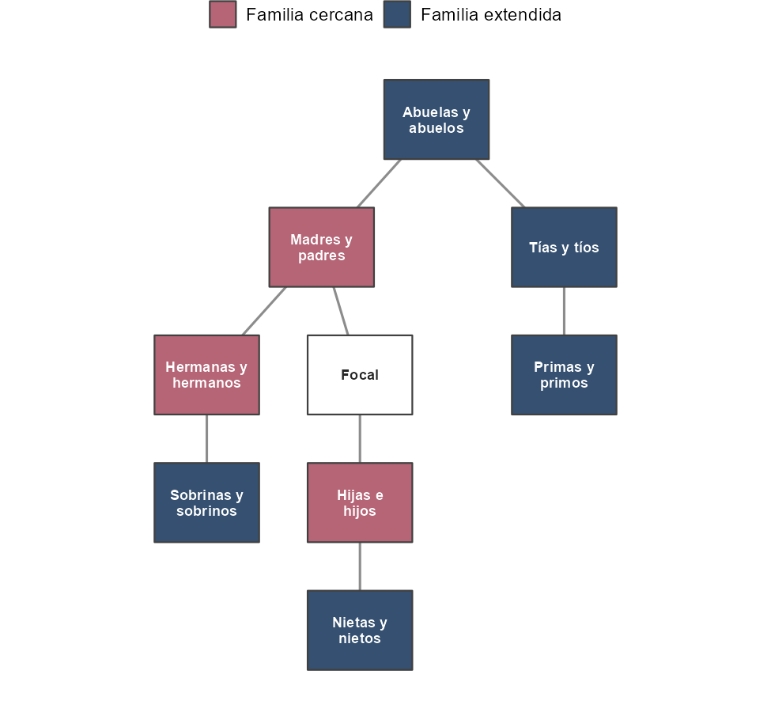

### Módulo 3 · Demografía de la pérdida: el conflicto colombiano {#modulo3}

*A cargo de Enrique Acosta.*

Este módulo combina una **presentación teórica** sobre la demografía del duelo
con un **laboratorio** en el que reproduciremos, paso a paso, las cuatro medidas
clave del artículo *Weaponizing Kinship* [@acosta_weaponizing_2026]:

1. la **incidencia anual** del duelo;
2. la **tabla de multiplicadores** de duelo;
3. la **prevalencia acumulada** del duelo (a 2018);
4. la **distribución por edad** de la prevalencia (pirámide poblacional de 2018,
   coloreada según el tipo de familia perdida).

> La parte teórica (qué es el duelo a nivel poblacional, por qué importa, cómo se
> inserta en la tradición de Goodman-Keyfitz-Pullum y Caswell) se desarrolla en
> la presentación. Aquí nos concentramos en el cómputo.

Consideraremos **únicamente los homicidios** relacionados con el conflicto (el
artículo también analiza las desapariciones forzadas).

```{r m3-libs, message=FALSE}
library(tidyverse)
library(DemoKin)
library(arrow)
```

**Contenido de este módulo:**

- [3.1 Los datos](#m3-datos)
- [3.2 El modelo de duelo: marco metodológico](#m3-metodo)
- [3.3 Medida 1: incidencia anual](#m3-incidencia)
- [3.4 Medida 2: multiplicadores de duelo](#m3-multiplicadores)
- [3.5 Medida 3: prevalencia acumulada](#m3-prevalencia)
- [3.6 Medida 4: distribución por edad de la prevalencia](#m3-piramide)

#### 3.1 Los datos {#m3-datos}

Usaremos tres insumos, todos en `data/colombia/` (su documentación completa está
en la pestaña **Datos**):

```{r m3-setup}
dcol <- "data/colombia"

# (a) Datos demográficos colombianos: son los INSUMOS del modelo de parentesco
#     (fecundidad fx, supervivencia px, población nx) más la población y el
#     factor ax que usaremos para el duelo, por año, sexo y edad (1950-2018).
demo <- read_parquet(file.path(dcol, "col_demo_1950_2018.parquet"))
pop <- demo %>% select(year, sex, age, pop, ax)

# (b) Muertes por homicidio (conflicto), por año, sexo y edad de la víctima.
homicidios <- read_parquet(file.path(dcol, "col_homicidios_1985_2018.parquet"))

# (c) Proporción de inmigrantes (se excluyen del riesgo de duelo).
inmigrantes <- read_parquet(file.path(dcol, "col_inmigrantes_2018.parquet"))
```

El cuarto insumo es la **estructura de parentesco** (`kin`): cuántos parientes
vivos de cada tipo tiene una persona promedio, por año y por sexo/edad de Focal y
del pariente. No es un dato externo: es la **salida del modelo que ya ajustamos en
el Módulo 2** (de dos sexos y variable en el tiempo), con salida por período
1985–2018 y para Focal de ambos sexos.

Para no volver a correr el modelo —que es el paso costoso— lo **reutilizamos**:
leemos el archivo que guardó el Módulo 2. Si por alguna razón no existiera, el
mismo bloque lo regenera, con los datos del WPP para Colombia y los mismos atajos
del Módulo 2 (se corre para Focal mujer y se copia para Focal hombre):

> **Nota sobre los insumos del parentesco.** La estructura de parentesco proviene
> del modelo del Módulo 2, ajustado con las tasas del **WPP** para Colombia
> (1950–2023). El artículo original usa tasas colombianas propias que arrancan en
> 1900. Como DemoKin supone una población estable antes del primer año (véase
> "condiciones de frontera", Módulo 2) y las tasas no son idénticas, nuestras
> estimaciones de parentesco —sobre todo de parientes lejanos— son **cercanas pero
> no idénticas** a las publicadas.

```{r m3-kin}
archivo_kin <- file.path(dcol, "col_kin_1985_2018.parquet")

if (!file.exists(archivo_kin)) {
  # Reconstruir el archivo (normalmente ya lo generó el Módulo 2).
  col <- read_parquet("data/wpp_latam/wpp_COL.parquet")
  reshape_wpp <- function(dat, variable, which_sex) {
    dat %>%
      filter(sex == which_sex) %>%
      select(age, year, value = all_of(variable)) %>%
      arrange(age, year) %>%
      pivot_wider(names_from = year, values_from = value) %>%
      select(-age) %>%
      as.matrix()
  }

  # Correr el modelo para Focal mujer y copiarlo para Focal hombre (eficiencia).
  kin_f <- kin2sex(
    pf = reshape_wpp(col, "px", "f"), pm = reshape_wpp(col, "px", "m"),
    ff = reshape_wpp(col, "fx", "f"), fm = reshape_wpp(col, "fx", "f"),
    nf = reshape_wpp(col, "pop", "f"), nm = reshape_wpp(col, "pop", "m"),
    time_invariant = FALSE, output_period = 1985:2018,
    output_kin = c("d", "m", "s", "gm", "gd", "a", "n", "c"),
    sex_focal = "f", birth_female = 0.5
  )
  kin <- bind_rows(
    as_tibble(kin_f$kin_full) %>% mutate(sex_focal = "f"),
    as_tibble(kin_f$kin_full) %>% mutate(sex_focal = "m")
  ) %>%
    transmute(
      year = as.integer(year), sex_focal,
      age_focal = as.integer(age_focal), kin, sex_kin,
      age_kin = as.integer(age_kin), living
    ) %>%
    filter(living >= 1e-6)
  write_parquet(kin, archivo_kin)
}

kin <- read_parquet(archivo_kin)
```

```{r m3-glimpse}
glimpse(kin)
```

Definimos etiquetas legibles y los **dos grupos de parentesco** que usa el
artículo (lo que llamamos familia *extendida* es lo que el artículo llama
*distant/lejana*):

| Grupo | Parientes que lo componen | Códigos |
|---|---|---|
| **Familia cercana** ($\mathcal{C}$) | hijas/os, madres/padres, hermanas/os | `d`, `m`, `s` |
| **Familia extendida** ($\mathcal{D}$) | abuelas/os, nietas/os, tías/os, sobrinas/os, primas/os | `gm`, `gd`, `a`, `n`, `c` |

El siguiente diagrama sitúa a cada tipo de pariente respecto de Focal y lo colorea
según pertenezca a la familia **cercana** (rosa) o **extendida** (azul). Estos son
los mismos colores que usaremos en todas las figuras del módulo:



```{r m3-labels}
etiquetas_kin <- c(
  d = "Hijas e hijos", m = "Madres y padres", s = "Hermanas y hermanos",
  gm = "Abuelas y abuelos", gd = "Nietas y nietos", a = "Tías y tíos",
  n = "Sobrinas y sobrinos", c = "Primas y primos"
)
parientes_cercanos <- c("d", "m", "s")
parientes_extendidos <- c("gm", "gd", "a", "n", "c")
```

#### 3.2 El modelo de duelo: marco metodológico {#m3-metodo}

El objetivo es estimar **cuántas personas han perdido al menos un pariente** de
un tipo dado a causa del conflicto. La lógica combina tres ingredientes: la
**estructura de parentesco** (cuántos parientes vivos hay), las **muertes por
homicidio** (con qué probabilidad muere cada pariente) y la **población**
expuesta.

**Paso 1 — Probabilidad de muerte de un pariente.** A partir del número de
homicidios $d$ a la edad $y$ y sexo $g$ en el año $t$, y de la población
correspondiente, obtenemos una tasa de mortalidad por homicidio
$m_{ygt} = d_{ygt} / \text{pob}_{ygt}$ y la convertimos en probabilidad con la
relación estándar de tabla de vida:

$$
q_{ygt} = \frac{m_{ygt}}{1 + (1 - a_x)\,m_{ygt}}.
$$

**Paso 2 — Probabilidad de NO perder ningún pariente (anual).** Para una persona
*Focal* de sexo $s$ y edad $x$ en el año $t$, suponiendo independencia entre las
muertes de sus parientes, la probabilidad de **no** perder ningún pariente del
tipo $k$ es el producto, sobre todas las edades $y$ y sexos $g$ de los parientes,
de la probabilidad de que cada uno sobreviva, elevada al número esperado de
parientes $n$ en esa celda [@acosta_weaponizing_2026]:

$$
p^{0}_{k,x,s,t} = \prod_{g}\prod_{y} \left(1 - q_{ygt}\right)^{\,n_{k,x,s,y,g,t}}.
$$

La probabilidad de perder **al menos un** pariente del tipo $k$ ese año es su
complemento, $1 - p^{0}_{k,x,s,t}$.

**Paso 3 — Prevalencia acumulada.** El duelo es un estado **absorbente**: una vez
que se pierde un pariente, la persona queda en duelo para el resto de su vida.
La probabilidad de **no** haber perdido ningún pariente del tipo $k$ a lo largo
de la vida, hasta la edad $a$ en el año $t$, es el producto de las
probabilidades anuales a lo largo de la trayectoria de la cohorte
$c = t - a$:

$$
p^{0A}_{k,a,s,t} = \prod_{x=0}^{a} p^{0}_{k,c,x,s}.
$$

La probabilidad acumulada de haber perdido al menos un pariente es
$p^{>0A}_{k,a,s,t} = 1 - p^{0A}_{k,a,s,t}$.

**Paso 4 — De probabilidades a personas.** Multiplicamos por la población
expuesta (excluyendo inmigrantes, que no estuvieron expuestos al conflicto):

$$
f^{A}_{k,a,s,t} = p^{>0A}_{k,a,s,t} \times \text{pob}_{a,s,t} \times (1 - \text{mig}_{a,s,t}).
$$

**Paso 5 — Multiplicador de duelo.** El número total de personas en duelo por el
pariente $k$ dividido entre el número total de homicidios:

$$
M_k = \frac{\sum_{a,s} f^{A}_{k,a,s,t}}{\text{homicidios totales}}.
$$

Traducimos estos cinco pasos a código. Primero, la probabilidad de muerte por
homicidio de un pariente en cada celda de edad-sexo-año (Paso 1). Seguimos el
artículo acotando $q$ a un máximo de 0.4 para estabilizar estratos con pocos
casos:

```{r m3-qx}
qx_kin <- homicidios %>%
  left_join(pop, by = c("year", "sex", "age")) %>%
  mutate(
    mx_h = dx / pop,
    qx_h = mx_h / (1 + (1 - ax) * mx_h),
    qx_h = pmin(qx_h, 0.4)
  ) %>%
  transmute(year, sex_kin = sex, age_kin = age, qx_kin = qx_h)
```

Ahora la probabilidad anual de no perder ningún pariente (Paso 2). Unimos la
estructura de parentesco con estas probabilidades y aplicamos la fórmula del
producto:

```{r m3-p0, cache=TRUE}
p0_anual <- kin %>%
  left_join(qx_kin, by = c("year", "sex_kin", "age_kin")) %>%
  mutate(p0x = (1 - qx_kin)^living) %>%
  summarise(
    p0 = prod(p0x, na.rm = TRUE),
    .by = c(year, sex_focal, age_focal, kin)
  )
```

También calculamos la **exposición** de 2018 (población menos inmigrantes),
que usaremos para convertir probabilidades en personas:

```{r m3-expo}
exposicion_2018 <- pop %>%
  filter(year == 2018) %>%
  left_join(inmigrantes, by = c("sex", "age")) %>%
  mutate(
    imm_r = replace_na(imm_r, 0),
    exposicion = pop * (1 - imm_r)
  ) %>%
  transmute(sex_focal = sex, age_focal = age, exposicion)
```

##### Grupos de parentesco: cómo se combinan {#m3-grupos}

Además de los ocho tipos individuales, agrupamos los parientes en **familia
cercana** ($\mathcal{C}$) y **familia extendida** ($\mathcal{D}$) (véase la tabla
de arriba). La pregunta "¿perdió al menos un pariente **del grupo**?" requiere
combinar las probabilidades de no perder a *ninguno* de sus miembros. Suponiendo
independencia entre los tipos de pariente, la probabilidad de **no** perder a
nadie de un grupo es el **producto** de las probabilidades acumuladas de sus
miembros [@acosta_weaponizing_2026]:

$$
p_0^{\mathcal{C}} = \prod_{k \in \mathcal{C}} p^{0A}_{k}, \qquad
p_0^{\mathcal{D}} = \prod_{k \in \mathcal{D}} p^{0A}_{k}.
$$

Con estas dos probabilidades podemos clasificar a **toda** la población en
**cuatro categorías mutuamente excluyentes**, según haya perdido o no parientes
cercanos y/o extendidos:

$$
\begin{aligned}
P(\text{solo cercana})       &= (1 - p_0^{\mathcal{C}})\; p_0^{\mathcal{D}}, \\
P(\text{solo extendida})     &= p_0^{\mathcal{C}}\;(1 - p_0^{\mathcal{D}}), \\
P(\text{cercana y extendida})&= (1 - p_0^{\mathcal{C}})\,(1 - p_0^{\mathcal{D}}), \\
P(\text{no en duelo})        &= p_0^{\mathcal{C}}\; p_0^{\mathcal{D}}.
\end{aligned}
$$

La lógica booleana detrás de estas cuatro categorías se ve mejor con un
**diagrama de Venn**: el círculo izquierdo son quienes han perdido al menos un
pariente **cercano** (el complemento de $p_0^{\mathcal{C}}$); el derecho, quienes
han perdido al menos un pariente **extendido** (complemento de
$p_0^{\mathcal{D}}$). Su **intersección** es la categoría "cercana y extendida";
su **unión** (toda el área sombreada) es "cercana o extendida", con probabilidad
$1 - p_0^{\mathcal{C}}\,p_0^{\mathcal{D}}$.


Las cuatro suman 1: cada persona cae en exactamente una. La probabilidad de haber
perdido **al menos un pariente cualquiera** (*cercana O extendida*) es el
complemento de "no en duelo":
$P(\text{cercana o extendida}) = 1 - p_0^{\mathcal{C}}\, p_0^{\mathcal{D}}$.
Multiplicando cada probabilidad por la población expuesta y sumando obtenemos el
número de personas en cada categoría. Usaremos estas fórmulas en la prevalencia
(Medida 3) y en la pirámide (Medida 4).

#### 3.3 Medida 1: incidencia anual del duelo {#m3-incidencia}

La **incidencia anual** responde a la pregunta: *¿cuántas personas pierden al
menos un pariente de un tipo dado en un año determinado?* Es una medida de
**flujo**: cuenta los duelos **nuevos** que ocurren cada año, y por eso es la
manera más directa de ver cómo la violencia del conflicto se traduce, año a año,
en pérdidas familiares.

El punto de partida son las **muertes por homicidio** que ya cargamos. Conviene
mirarlas primero, porque son el motor de todo lo demás: los años con más
homicidios serán los años con más personas en duelo.

```{r m3-deaths-plot, fig.height=3.5}
homicidios %>%
  summarise(muertes = sum(dx), .by = year) %>%
  ggplot(aes(x = year, y = muertes / 1000)) +
  geom_col(fill = "#888888", width = 0.8) +
  labs(
    title = "Homicidios anuales relacionados con el conflicto (Colombia)",
    x = "Año", y = "Muertes (miles)"
  ) +
  theme_bw()
```

Para pasar de muertes a personas en duelo, tomamos la probabilidad anual de
perder al menos un pariente, $1 - p^0$ (calculada arriba), la multiplicamos por
la población y sumamos sobre el sexo y la edad de Focal. Calculamos primero la
incidencia por tipo individual de pariente (la reutilizaremos en los
multiplicadores):

```{r m3-inc-calc}
pop_focal <- pop %>% select(year, sex_focal = sex, age_focal = age, pop)

incidencia <- p0_anual %>%
  left_join(pop_focal, by = c("year", "sex_focal", "age_focal")) %>%
  mutate(en_duelo = (1 - p0) * pop) %>%
  summarise(en_duelo = sum(en_duelo), .by = c(year, kin))
```

> **¿Por qué no apilar los tipos de pariente?** Sería tentador apilar la
> incidencia de cada tipo de pariente en una sola barra, pero eso **cuenta doble**:
> una misma persona puede perder, el mismo año, un primo *y* una tía, y aparecería
> en ambas categorías. La incidencia de "al menos un pariente" no es aditiva. Por
> eso mostramos la incidencia por **grupo de familia** (cercana y extendida),
> combinando a los miembros del grupo con la fórmula de producto vista arriba.

```{r m3-inc-grupo}
incidencia_familia_anual <- function(tipos, etiqueta) {
  p0_anual %>%
    filter(kin %in% tipos) %>%
    summarise(p0 = prod(p0), .by = c(year, sex_focal, age_focal)) %>%
    left_join(pop_focal, by = c("year", "sex_focal", "age_focal")) %>%
    mutate(en_duelo = (1 - p0) * pop) %>%
    summarise(en_duelo = sum(en_duelo), .by = year) %>%
    mutate(grupo = etiqueta)
}

incidencia_familia <- bind_rows(
  incidencia_familia_anual(parientes_cercanos, "Familia cercana"),
  incidencia_familia_anual(parientes_extendidos, "Familia extendida")
)
```

Graficamos la incidencia anual de cada grupo con barras agrupadas (como en el
estudio sobre Gaza). Los picos coinciden con los años más violentos del conflicto
(compárese con la gráfica de homicidios de arriba):

```{r m3-inc-plot, fig.height=4.5}
incidencia_familia %>%
  ggplot(aes(x = year, y = en_duelo / 1000, fill = grupo)) +
  geom_col(position = position_dodge(width = 0.8), width = 0.7) +
  scale_fill_manual(values = c(
    "Familia cercana" = "#b56576",
    "Familia extendida" = "#355070"
  )) +
  scale_y_continuous(labels = scales::comma) +
  labs(
    title = "Incidencia anual del duelo por homicidio (Colombia, 1985-2018)",
    x = "Año", y = "Personas en duelo (miles)", fill = "Grupo de familia"
  ) +
  theme_bw()
```

> **Interpretación.** Cada año, el conflicto deja en duelo a decenas de miles de
> personas, muchas más a través de la familia **extendida** que de la cercana:
> aunque la probabilidad de perder a *un* primo específico es baja, cada persona
> tiene **muchos** parientes extendidos, de modo que la probabilidad de perder *al
> menos uno* es alta. Esta es la intuición central de la demografía del duelo: el
> **tamaño** de la red de parentesco amplifica el efecto de cada muerte.

#### 3.4 Medida 2: multiplicadores de duelo {#m3-multiplicadores}

El **multiplicador de duelo** resume, en un solo número, el alcance social de la
violencia: *¿cuántas personas quedan en duelo por cada homicidio?* Es el cociente
entre las **personas en duelo** y el **número de muertes**:

$$
\text{Multiplicador}_k = \frac{\text{personas en duelo por el pariente } k}{\text{número de homicidios}}.
$$

Usamos la **incidencia** que acabamos de calcular como numerador (personas que
quedan en duelo, sumadas sobre todo el período 1985–2018) y el total de
homicidios como denominador. Es decir, es una medida de **incidencia por
muerte**: cuántos duelos genera, en promedio, cada homicidio.

Para los grupos de familia (cercana, extendida, o cualquiera) combinamos primero
las probabilidades anuales de los parientes del grupo (como en la sección de
grupos de arriba) y luego calculamos la incidencia:

```{r m3-mult-calc}
muertes_total <- sum(homicidios$dx) # total de homicidios 1985-2018

# incidencia total (1985-2018) de un grupo de parientes
incidencia_grupo <- function(tipos) {
  p0_anual %>%
    filter(kin %in% tipos) %>%
    summarise(p0 = prod(p0), .by = c(year, sex_focal, age_focal)) %>%
    left_join(pop_focal, by = c("year", "sex_focal", "age_focal")) %>%
    mutate(en_duelo = (1 - p0) * pop) %>%
    summarise(en_duelo = sum(en_duelo)) %>%
    pull(en_duelo)
}

# por tipo de pariente
mult_kin <- incidencia %>%
  summarise(personas = sum(en_duelo), .by = kin) %>%
  mutate(kin = recode(kin, !!!etiquetas_kin))

# por grupo de familia
mult_grupos <- tibble(
  kin = c("Familia cercana", "Familia extendida", "Cercana o extendida"),
  personas = c(
    incidencia_grupo(parientes_cercanos),
    incidencia_grupo(parientes_extendidos),
    incidencia_grupo(names(etiquetas_kin))
  )
)

# orden de la tabla igual que en el artículo publicado
orden_tabla <- c(
  "Hijas e hijos", "Madres y padres", "Hermanas y hermanos",
  "Abuelas y abuelos", "Sobrinas y sobrinos", "Nietas y nietos",
  "Primas y primos", "Tías y tíos",
  "Familia cercana", "Familia extendida", "Cercana o extendida"
)

tabla_multiplicadores <- bind_rows(mult_kin, mult_grupos) %>%
  mutate(
    muertes = muertes_total,
    multiplicador = round(personas / muertes, 1),
    personas = round(personas),
    kin = factor(kin, levels = orden_tabla)
  ) %>%
  arrange(kin)
```

```{r m3-mult-table, echo=FALSE}
knitr::kable(
  tabla_multiplicadores %>%
    transmute(
      `Pariente` = kin,
      `Personas en duelo (incidencia)` = personas,
      `Muertes (homicidios)` = round(muertes),
      `Multiplicador` = multiplicador
    ),
  format.args = list(big.mark = ","),
  caption = paste(
    "Multiplicadores de duelo por homicidio, Colombia 1985-2018.",
    "'Personas en duelo' es la incidencia (duelos nuevos sumados",
    "sobre el período); el multiplicador es esas personas por homicidio."
  )
)
```

> **Interpretación.** El multiplicador es mucho mayor para la familia extendida
> que para la cercana: cada homicidio deja en duelo a muchas más personas a través
> de primos, tíos y sobrinos que a través de hijos, padres y hermanos, simplemente
> porque hay más parientes extendidos. La tercera columna muestra el denominador
> común (el total de homicidios), para que quede claro que el multiplicador es
> **personas en duelo por muerte**.

#### 3.5 Medida 3: prevalencia acumulada del duelo {#m3-prevalencia}

Mientras que la incidencia es un flujo (duelos nuevos por año), la **prevalencia
acumulada** es un **stock**: cuenta a las personas que han perdido al menos un
pariente **en algún momento de su vida**, hasta 2018. Como el duelo es un estado
que no se revierte, aplicamos el producto acumulado (`cumprod`) de las
probabilidades anuales a lo largo de la trayectoria de cada cohorte
($c = \text{año} - \text{edad}$), y nos quedamos con el año 2018 (Paso 3):

```{r m3-cum, cache=TRUE}
p0_acum <- p0_anual %>%
  mutate(cohorte = year - age_focal) %>%
  group_by(sex_focal, cohorte, kin) %>%
  arrange(age_focal, .by_group = TRUE) %>%
  mutate(p0_acum = cumprod(p0)) %>%
  ungroup() %>%
  filter(year == 2018)
```

Una función auxiliar calcula el **número de personas** que, hacia 2018, habían
perdido al menos un pariente de un conjunto dado. Combina la probabilidad
acumulada de los miembros del conjunto (producto de sus $p^{0A}$, como en la
sección de grupos), la convierte en probabilidad de pérdida y la multiplica por
la exposición:

```{r m3-cum-helper}
en_duelo_prev <- function(tipos) {
  p0_acum %>%
    filter(kin %in% tipos) %>%
    summarise(p0_acum = prod(p0_acum), .by = c(sex_focal, age_focal)) %>%
    left_join(exposicion_2018, by = c("sex_focal", "age_focal")) %>%
    mutate(b = (1 - p0_acum) * exposicion) %>%
    summarise(personas = sum(b)) %>%
    pull(personas)
}
```

Estimamos la prevalencia por tipo individual de pariente **y** por grupo de
familia (cercana, extendida, y cercana-o-extendida), en número de personas y como
porcentaje de la población:

```{r m3-cum-calc}
poblacion_2018 <- sum(exposicion_2018$exposicion)

prev_kin <- tibble(kin = names(etiquetas_kin)) %>%
  mutate(
    personas = map_dbl(kin, en_duelo_prev),
    etiqueta = recode(kin, !!!etiquetas_kin),
    grupo = if_else(kin %in% parientes_cercanos, "Cercana", "Extendida")
  )

prev_grupos <- tibble(
  etiqueta = c("Familia cercana", "Familia extendida", "Cercana o extendida"),
  personas = c(
    en_duelo_prev(parientes_cercanos),
    en_duelo_prev(parientes_extendidos),
    en_duelo_prev(names(etiquetas_kin))
  ),
  grupo = "Grupo"
)

prevalencia <- bind_rows(prev_kin %>% select(etiqueta, personas, grupo), prev_grupos) %>%
  mutate(
    millones = personas / 1e6,
    pct = 100 * personas / poblacion_2018
  )
```

Siguiendo el artículo, mostramos los **parientes individuales** en un panel y los
**grupos de familia** en otro, en el mismo orden que la publicación:

```{r m3-cum-plot, fig.height=6}
orden_individual <- c(
  "Hijas e hijos", "Madres y padres", "Hermanas y hermanos",
  "Abuelas y abuelos", "Sobrinas y sobrinos", "Nietas y nietos",
  "Primas y primos", "Tías y tíos"
)
orden_grupo <- c("Familia cercana", "Familia extendida", "Cercana o extendida")

prevalencia %>%
  mutate(
    panel = if_else(grupo == "Grupo", "Grupos de familia", "Parientes individuales"),
    panel = factor(panel, levels = c("Parientes individuales", "Grupos de familia")),
    etiqueta = factor(etiqueta, levels = rev(c(orden_individual, orden_grupo)))
  ) %>%
  ggplot(aes(x = etiqueta, y = millones, fill = grupo)) +
  geom_col() +
  geom_text(aes(label = sprintf("%.1f M (%.0f%%)", millones, pct)),
    hjust = -0.1, size = 3
  ) +
  coord_flip() +
  facet_grid(panel ~ ., scales = "free_y", space = "free_y") +
  scale_fill_manual(values = c(
    "Cercana" = "#b56576", "Extendida" = "#355070",
    "Grupo" = "grey55"
  )) +
  scale_y_continuous(expand = expansion(mult = c(0, 0.25))) +
  labs(
    title = "Prevalencia acumulada del duelo por homicidio en 2018",
    subtitle = "Personas que han perdido al menos un pariente del tipo/grupo indicado",
    x = NULL, y = "Personas en duelo (millones)", fill = "Grupo"
  ) +
  theme_bw()
```

> **Resultado clave.** Hacia 2018, cerca de
> `r sprintf("%.1f", prevalencia$millones[prevalencia$etiqueta=="Cercana o extendida"])`
> millones de personas
> (`r sprintf("%.0f%%", prevalencia$pct[prevalencia$etiqueta=="Cercana o extendida"])`
> de la población) habían perdido al menos un pariente por homicidios del
> conflicto. La familia **extendida** domina: por ejemplo, unos
> `r sprintf("%.1f", prevalencia$millones[prevalencia$etiqueta=="Primas y primos"])`
> millones perdieron al menos un primo o prima. Estas cifras son directamente
> comparables con la Figura 4 del artículo (que reporta ~11.8 millones para primos
> considerando homicidios *y* desapariciones). Nuestra cifra difiere un poco por
> dos motivos que operan en sentidos opuestos: consideramos **solo homicidios**
> (lo que la reduce) y el modelo **inicia en 1950** (lo que la aumenta; véase la
> nota del punto 3.1). El resultado global —cerca del 40% de la población en
> duelo— coincide con el titular del artículo.

#### 3.6 Medida 4: distribución por edad de la prevalencia {#m3-piramide}

La prevalencia total esconde un patrón por edad muy marcado. Para verlo,
representamos **toda la población** de 2018 en una **pirámide poblacional**,
coloreando cada barra según las **cuatro categorías mutuamente excluyentes** que
definimos antes: no en duelo, solo familia cercana, solo familia extendida, o
ambas. Es, en el fondo, la distribución por edad y sexo de la prevalencia.

Usamos directamente las fórmulas de producto (no hace falta inclusión-exclusión):
para cada edad y sexo calculamos $p_0^{\mathcal{C}}$ y $p_0^{\mathcal{D}}$ y de
ahí las cuatro categorías, que por construcción suman la población total:

```{r m3-pir-calc}
pop_2018 <- pop %>%
  filter(year == 2018) %>%
  transmute(sex_focal = sex, age_focal = age, pop)

# p0 acumulado de cada grupo, por edad y sexo (producto sobre los miembros)
p0_grupo <- function(tipos) {
  p0_acum %>%
    filter(kin %in% tipos) %>%
    summarise(p0 = prod(p0_acum), .by = c(sex_focal, age_focal))
}
pC <- p0_grupo(parientes_cercanos) %>% rename(p0_C = p0)
pD <- p0_grupo(parientes_extendidos) %>% rename(p0_D = p0)

piramide <- pC %>%
  left_join(pD, by = c("sex_focal", "age_focal")) %>%
  left_join(pop_2018, by = c("sex_focal", "age_focal")) %>%
  mutate(
    `No en duelo`                 = p0_C * p0_D * pop,
    `Solo familia cercana`        = (1 - p0_C) * p0_D * pop,
    `Solo familia extendida`      = p0_C * (1 - p0_D) * pop,
    `Familia cercana y extendida` = (1 - p0_C) * (1 - p0_D) * pop
  ) %>%
  pivot_longer(
    c(
      `No en duelo`, `Solo familia cercana`,
      `Solo familia extendida`, `Familia cercana y extendida`
    ),
    names_to = "categoria", values_to = "personas"
  ) %>%
  mutate(
    categoria = factor(categoria, levels = c(
      "No en duelo", "Solo familia extendida",
      "Familia cercana y extendida", "Solo familia cercana"
    )),
    # mujeres a la izquierda (valores negativos), hombres a la derecha
    personas = ifelse(sex_focal == "f", -personas, personas) / 1000
  )
```

```{r m3-pir-plot, fig.height=6}
colores <- c(
  "No en duelo"                 = "grey75",
  "Solo familia extendida"      = "#355070",
  "Familia cercana y extendida" = "#eaac8b",
  "Solo familia cercana"        = "#b56576"
)

piramide %>%
  ggplot(aes(x = age_focal, y = personas, fill = categoria)) +
  geom_col(width = 1) +
  geom_hline(yintercept = 0, linewidth = 0.2) +
  coord_flip() +
  scale_fill_manual(values = colores) +
  scale_y_continuous(labels = function(x) scales::comma(abs(x))) +
  labs(
    title = "Población de Colombia en 2018 según duelo por homicidio",
    subtitle = "Mujeres a la izquierda, hombres a la derecha",
    x = "Edad", y = "Población (miles)", fill = "Situación de duelo"
  ) +
  theme_bw() +
  theme(legend.position = "bottom")
```

> **Interpretación.** La pirámide muestra que el duelo por el conflicto está
> presente en **todas** las edades, pero se acumula con la edad: las personas
> mayores han estado expuestas al riesgo durante más años y por eso es más
> probable que hayan perdido a un familiar. La mayor parte del duelo ocurre a
> través de la **familia extendida** (azul), aunque una fracción importante ha
> perdido también parientes cercanos (naranja y rosa).

> **Nota sobre las cifras.** Como pedimos, usamos la **estimación central**
> (número medio de homicidios) en lugar de las 1000 réplicas de la estimación por
> sistemas múltiples del artículo. Por ello los valores son muy parecidos, pero
> no idénticos, a los publicados en @acosta_weaponizing_2026.

#### Recapitulación {#m3-recap}

En este módulo partimos de la estructura de parentesco del Módulo 2 y las muertes
por homicidio para reproducir las **cuatro medidas clave** del artículo: la
**incidencia** anual (duelos nuevos por año), los **multiplicadores** (personas en
duelo por muerte), la **prevalencia acumulada** a 2018 (el stock de personas en
duelo) y su **distribución por edad** (la pirámide). El hilo conductor fue siempre
el mismo: el **tamaño** de la red de parentesco —sobre todo la familia extendida—
amplifica el efecto demográfico de cada muerte.

En el **Módulo 4** te toca a ti: repetirás exactamente estos cuatro pasos para el
país que elijas, reutilizando el código que acabamos de escribir.
